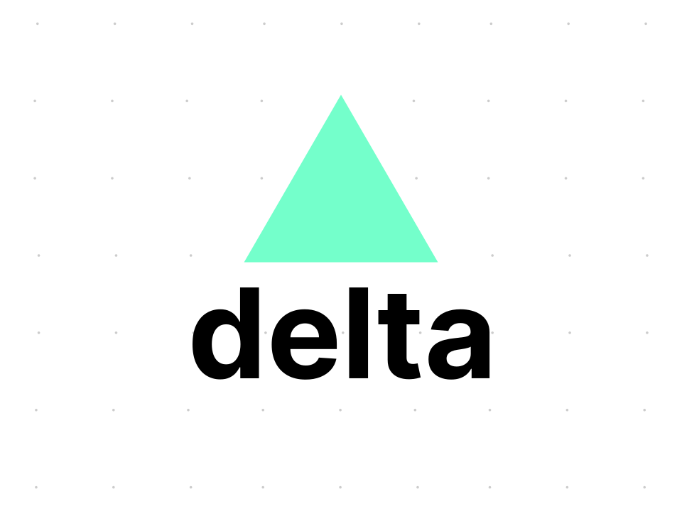

	
   
	
	

	<i>
		A simple yet powerful interpreted programming language
	</i>

- [x] lexer
  - [x] ops
  - [x] strings
  - [x] idents/keywords
  - [x] comments
  - [x] delimeters (both `\n` and `;`)
- [ ] parser
  - [x] convert token stream to postfix ops
  - [ ] parse tree generator
    - [x] binary exprs
    - [x] unary exprs
    - [x] literals (i think)
    - [ ] fn calls, fn defs
    - [ ] match patterns
  - [ ] `[LONG-TERM]` type-check tree
  - [ ] `[LONG-TERM]` bytecode generator
- [ ] evaluator
  - [ ] impl std::ops::\* for NodeResult
    - [x] add
    - [x] sub
    - [x] (logical) not
- [ ] vm
  - [ ] error handling
