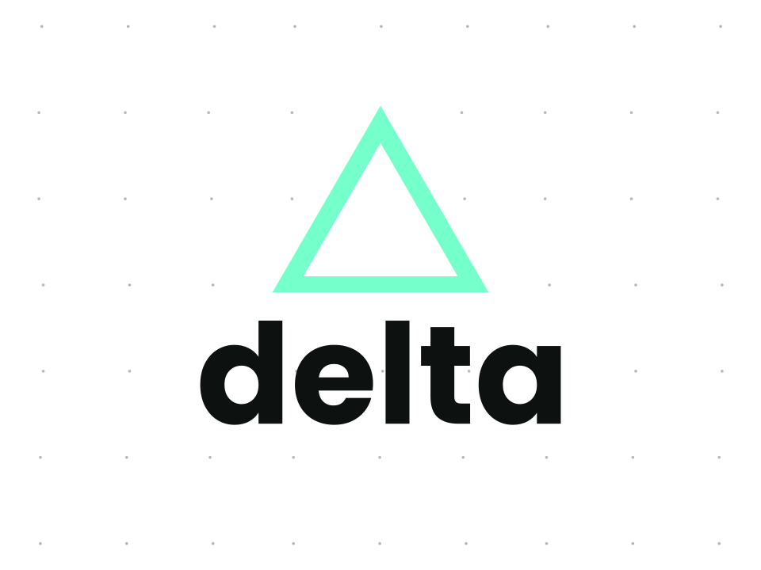

	
   
	
	

	<i>
		A simple yet powerful interpreted programming language
	</i>

- [x] lexer
  - [x] ops
  - [x] strings
  - [x] idents/keywords
  - [x] comments
  - [x] delimeters (both `\n` and `;`)
- [~] parser
  - [ ] `[IN-PROGRESS]` convert token stream to postfix ops
  - [ ] `[IN-PROGRESS]` parse tree generator
  - [ ] ast
  - [ ] `[LONG-TERM]` type-check tree
  - [ ] bytecode generator
- [ ] vm
  - [ ] error handling
